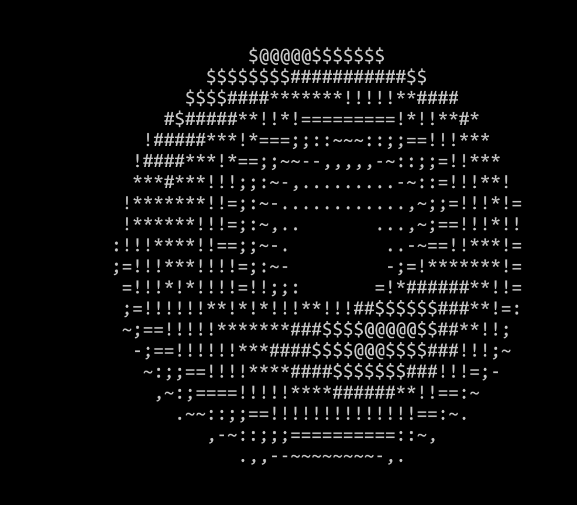

<!--
Inspired by:
https://github.com/othneildrew/Best-README-Template/blob/master/BLANK_README.md
***
*** To avoid retyping too much info. Do a search and replace for the following:
*** thylakoids, donut-in-terminal, twitter_handle, email
-->


<!-- PROJECT SHIELDS -->
[![Forks][forks-shield]][forks-url]
[![Stargazers][stars-shield]][stars-url]
[![Issues][issues-shield]][issues-url]
[![MIT License][license-shield]][license-url]


<!-- PROJECT LOGO -->
<br />
<p align="center">
  <a href="https://github.com/thylakoids/donut-in-terminal">
    
  </a>

  <h3 align="center">Donut in Terminal</h3>

  <p align="center">
    Rendering a donut using ASCII art
    <br />
    <a href="https://github.com/thylakoids/donut-in-terminal"><strong>Explore the docs »</strong></a>
    <br />
    <br />
    <a href="https://github.com/thylakoids/donut-in-terminal">View Demo</a>
    ·
    <a href="https://github.com/thylakoids/donut-in-terminal/issues">donut-in-terminalrt Bug</a>
    ·
    <a href="https://github.com/thylakoids/donut-in-terminal/issues">Request Feature</a>
  </p>
</p>


<!-- TABLE OF CONTENTS -->
## Table of Contents

<!-- vim-markdown-toc GFM -->

* [About The Project](#about-the-project)
* [Installation](#installation)
* [Usage](#usage)
* [Reference](#reference)

<!-- vim-markdown-toc -->


## About The Project

[![Product Name Screen Shot][product-screenshot]][product]

Learn C programming language and implement the `donut.c` to render a 3D
rotating donut in terminal.

## Installation
1. Clone the donut-in-terminal
```sh
git clone https://github.com/thylakoids/donut-in-terminal.git
```

## Usage
```shell
gcc src/donut/donut.c -o donut.out
./donut.out
```

Reference
---------
1. [Blog: optimizing-donut](https://www.a1k0n.net/2021/01/13/optimizing-donut.html)
2. [Blog: donut-math]( https://www.a1k0n.net/2011/07/20/donut-math.html )
3. [Youtube: C tutorial](https://www.youtube.com/watch?v=CPjZKsUYSXg&list=PL_c9BZzLwBRKKqOc9TJz1pP0ASrxLMtp2&index=2)
4. [Github: have-a-donut](https://github.com/kairess/have-a-donut)


<!-- MARKDOWN LINKS & IMAGES -->
<!-- https://www.markdownguide.org/basic-syntax/#reference-style-links -->
[forks-shield]: https://img.shields.io/github/forks/thylakoids/donut-in-terminal.svg?style=flat-square
[forks-url]: https://github.com/thylakoids/donut-in-terminal/network/members
[stars-shield]: https://img.shields.io/github/stars/thylakoids/donut-in-terminal.svg?style=flat-square
[stars-url]: https://github.com/thylakoids/donut-in-terminal/stargazers
[issues-shield]: https://img.shields.io/github/issues/thylakoids/donut-in-terminal.svg?style=flat-square
[issues-url]: https://github.com/thylakoids/donut-in-terminal/issues
[license-shield]: https://img.shields.io/github/license/thylakoids/donut-in-terminal.svg?style=flat-square
[license-url]: https://github.com/thylakoids/donut-in-terminal/blob/main/LICENSE
[product-screenshot]: images/donut.png
[product]: https://github.com/thylakoids/donut-in-terminal
